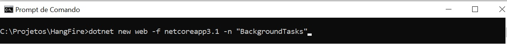
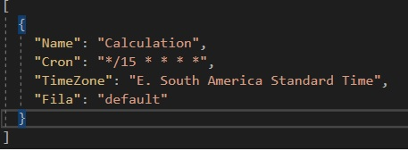
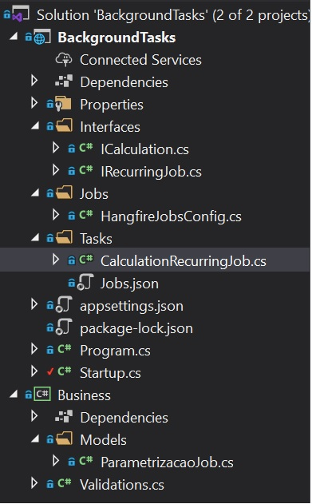
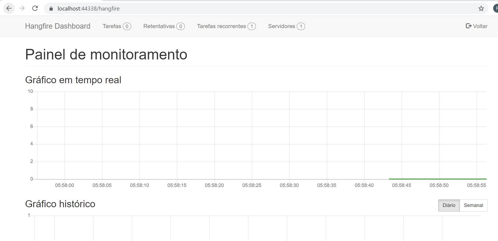
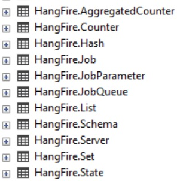
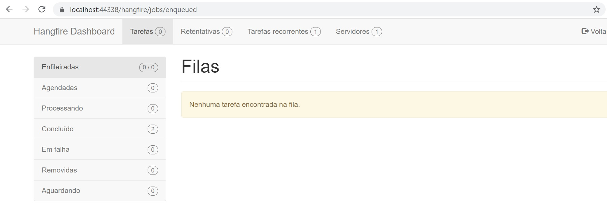
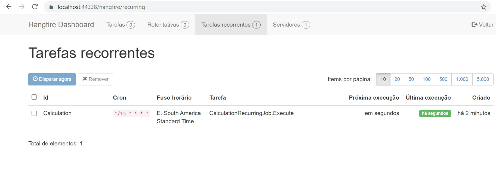

Hangfire 
=========

[](http://hangfire.io) [](https://www.nuget.org/packages?q=hangfire) [![License LGPLv3]

## Build Status

&nbsp; | `master` | `dev`
--- | --- | --- 
**Windows** | [](https://ci.appveyor.com/project/odinserj/hangfire-525)  | [](https://ci.appveyor.com/project/odinserj/hangfire-525) 
**Linux / OS X** | [](https://travis-ci.org/HangfireIO/Hangfire) | [](https://travis-ci.org/HangfireIO/Hangfire)

## Overview

Maneira incrivelmente fácil de executar tarefas ** dispare e esqueça **, ** atrasadas ** e ** recorrentes ** em ** aplicativos ASP.NET **. São suportados jobs com uso intensivo de CPU e E / S, de longa e curta duração. Nenhum serviço do Windows / Agendador de tarefas necessário. Apoiado por Redis, SQL Server, SQL Azure e MSMQ.

O Hangfire fornece um modelo de programação unificado para lidar com tarefas em segundo plano de uma ** maneira confiável ** e executá-las em hospedagem compartilhada, hospedagem dedicada ou em nuvem. Você pode começar com uma configuração simples e aumentar o poder computacional para trabalhos em segundo plano com o tempo para estes cenários:

- notificações em massa / boletins informativos
- importação em lote de xml, csv ou json
- criação de arquivos
- exclusão de usuários
- construção de gráficos diferentes
- processamento de imagem / vídeo
- purgando arquivos temporários
- relatórios automatizados recorrentes
- manutenção de banco de dados


Installation
-------------

Hangfire está disponível como um pacote NuGet

Hangfire.Core e Hangfire.AspNetCore


Exemplos:

Esta é uma lista incompleta de recursos; para ver todos eles, verifique o [site oficial] (http://hangfire.io) e a [documentação] (http://docs.hangfire.io).

[**Fire-and-forget tasks**](http://docs.hangfire.io/en/latest/background-methods/calling-methods-in-background.html)

Executam trabalhos em segundo plano enfileirados o mais rápido possível, reduzindo o tempo de processamento de sua solicitação.

```csharp
BackgroundJob.Enqueue(() => Console.WriteLine("Simple!"));
```

[**Delayed tasks**](http://docs.hangfire.io/en/latest/background-methods/calling-methods-with-delay.html)

Os trabalhos em segundo plano programados são executados apenas após um determinado período de tempo.

```csharp
BackgroundJob.Schedule(() => Console.WriteLine("Reliable!"), TimeSpan.FromDays(7));
```

[**Recurring tasks**](http://docs.hangfire.io/en/latest/background-methods/performing-recurrent-tasks.html)

Trabalhos recorrentes nunca foram tão simples; apenas chame o seguinte método para realizar qualquer tipo de tarefa recorrente usando as [expressões CRON] (http://en.wikipedia.org/wiki/Cron#CRON_expression).

```csharp
RecurringJob.AddOrUpdate(() => Console.WriteLine("Transparent!"), Cron.Daily);
```

**Continuations**


As continuações permitem definir fluxos de trabalho complexos, encadeando vários trabalhos em segundo plano

```csharp
var id = BackgroundJob.Enqueue(() => Console.WriteLine("Hello, "));
BackgroundJob.ContinueWith(id, () => Console.WriteLine("world!"));
```


Usage
------

**Nesse exemplo utilizamos apenas Recurring jobs**

Vamos lá.

Criamos Asp.Net Core Empty


Alteramos arquivo Startup.cs com as configurações abaixo:

No exemplo vamos utilizar MemoryStore onde Hangfire vai controlar os Jobs.

```csharp
       public void ConfigureServices(IServiceCollection services)
        {   
            services.AddHangfire(op =>
            {
                op.UseMemoryStorage();
            });
            Services = services;

            services.AddHangfireServer();
        }
```
Para utilizar o SQL é só alterar para o código abaixo

```csharp
services.AddHangfire(op =>
    { 
        op.UseSqlServerStorage(configuration.GetConnectionString("DefaultConnection"));

    });
```

```csharp
     public void Configure(IApplicationBuilder app, IWebHostEnvironment env)
        {

            app.UseHangfireDashboard();
            HangfireJobsConfig.ConfigureHangfireJobs(Services).Wait();       
        }
```
Criamos a Classe HangfireJobsConfig, para fazer a configuração das Tasks.

```csharp
public class HangfireJobsConfig
    {
        private static ICollection<Type> RecurringJobsTypes;

        static HangfireJobsConfig()
        {
            RecurringJobsTypes = new List<Type>();
            LoadRecurringJobs();
        }

        public static async Task ConfigureHangfireJobs(IServiceCollection services)
        {
            if (services == null) throw new ArgumentNullException(nameof(services));

            foreach (var recurringJob in RecurringJobsTypes)
            {

                IRecurringJob job = (IRecurringJob)Activator.CreateInstance(recurringJob, true);

                var recurringJobDto = await job.ConfigureJob(services.BuildServiceProvider());

                RecurringJob.AddOrUpdate(recurringJobDto.Id, () => job.Execute(null), recurringJobDto.Cron, TimeZoneInfo.FindSystemTimeZoneById(recurringJobDto.TimeZoneId), recurringJobDto.Queue);
            }
        }

        private static void LoadRecurringJobs()
        {
            var jobsTypes = Assembly.GetEntryAssembly().GetTypes().Where(t => !t.IsAbstract && typeof(IRecurringJob).IsAssignableFrom(t));

            foreach (var type in jobsTypes)
            {
                var emptyConstructor = type.GetConstructor(BindingFlags.Instance |
                    BindingFlags.Public | BindingFlags.NonPublic, null, Type.EmptyTypes, null);

                if (emptyConstructor == null)
                    throw new MissingMethodException(string.Format("Make sure [{0}] has a parameterless constructor", type.Name));

                RecurringJobsTypes.Add(type);
            }

        }
    }

```
Criamos a Classe CalculationReccuringJob

Obs.: Nesse momento eu pego as configurações do Job de um arquivo Jobs.json, o ideal é que essa configuração fique no banco de dados.




```csharp
public class CalculationRecurringJob : IRecurringJob
    {
        public async Task<RecurringJobDto> ConfigureJob(IServiceProvider serviceProvider)
        {
            List<ParametrizacaoJob> listaParametrizacaoJob = new List<ParametrizacaoJob>();
            string template = Path.Combine(Directory.GetCurrentDirectory(), "Tasks") + "\\Jobs.json";            

            using (StreamReader r = new StreamReader(template))
            {
                var json2 = r.ReadToEnd();
                listaParametrizacaoJob = JsonConvert.DeserializeObject<List<ParametrizacaoJob>>(json2);                
            }
            
            ParametrizacaoJob parametrizacaoJob  = listaParametrizacaoJob.FirstOrDefault(x => x.Name == "Calculation");
            return await Task.FromResult<RecurringJobDto>(new RecurringJobDto { Id = parametrizacaoJob.Name, Cron = parametrizacaoJob.Cron, TimeZoneId = parametrizacaoJob.TimeZone, Queue = parametrizacaoJob.Fila });
        }

        public async Task Execute(PerformContext context)
        {
            int resultado = 0;
            resultado = 1 + 1;
        }
    }

```
Estrutura da Solution



Já podemos rodar nossa aplicação. 

Rodando o projeto agora, podemos encontrar o dashboard do Hangfire em “[SuaUrl]/hangfire”:


Caso você rode utilizando um provider de banco de dados, o Hangfire criará as seguintes tabelas:


Tela principal temos o painel de monitoramento em tempo real:


Em Tarefas temos as Filas, mostrando as tarefas agendadas, tarefas processando, tarefas com sucesso e tarefas com falhas


Em tarefas recorrentes estão todas as tarefas configuradas para serem excutadas com sua configuração Cron, nesse caso só criamos uma.

